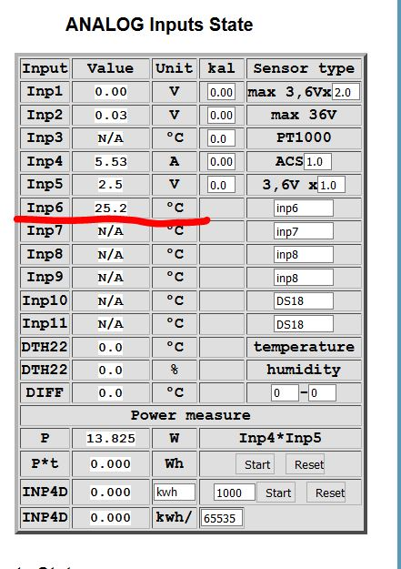

# checkmk-tinycontroll

Plugin read temperature from tinycontroll via SNMP v1

Variable edited via WATO:

Read MIB:

.1.3.6.1.4.1.17095.5.1.0 = INTEGER: 251

OID:

.1.3.6.1.2.1.1.2.0 = OID: .1.3.6.1.4.1.17095

Check_Mk services:

Tinycontroll OUTPUT:

 
